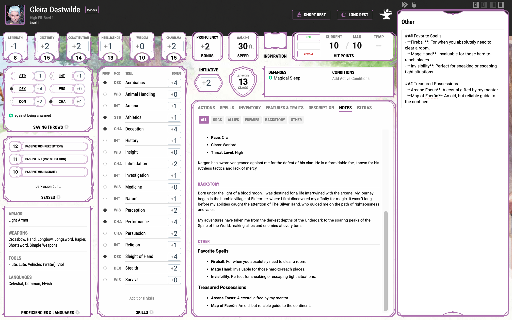
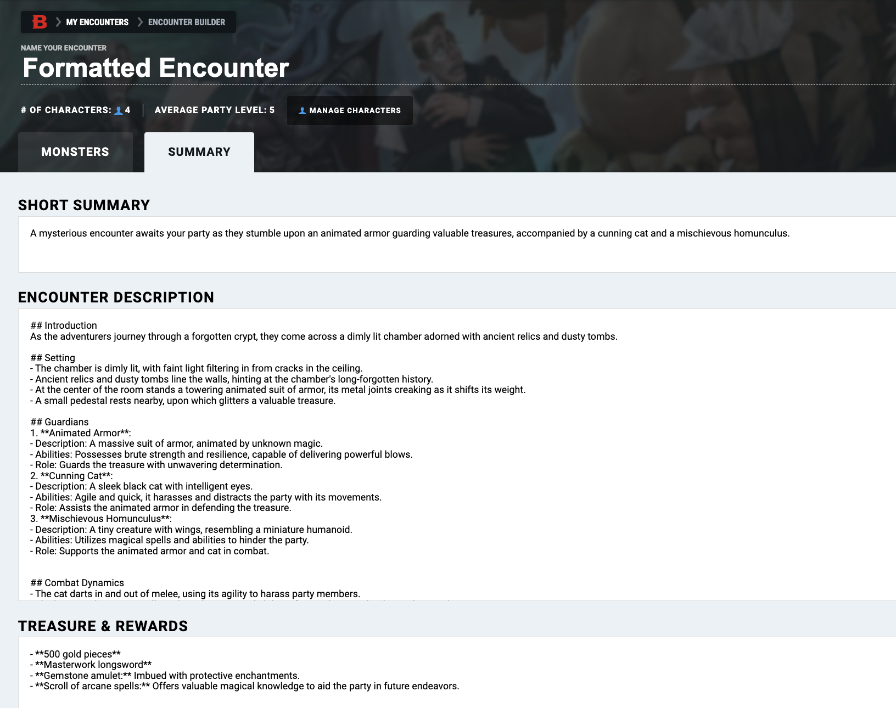
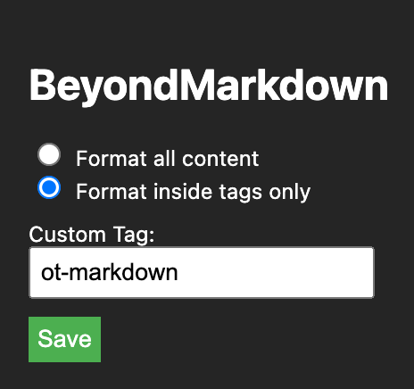

# BeyondMarkdown

Welcome to BeyondMarkdown, the Chrome Extension designed to supercharge your D&D Beyond adventure logging. By transforming markdown in character and encounter notes descriptions into beautifully formatted HTML, BeyondMarkdown elevates your note-taking to new heights. This means more time for adventure crafting and less fuss over formatting.

> [!NOTE]
> **New Markdown Features Powered by ShowdownJS:** We've integrated [ShowdownJS](https://github.com/showdownjs/showdown) version 2.1.0 to expand our markdown capabilities. Now, you can enrich your notes with tables, checklists, and embrace the full spectrum of markdown syntax. This upgrade ensures your documentation is not only more expressive but also visually appealing.

## Features

- **Seamless Conversion**: Automatically converts markdown syntax within D&D Beyond character notes, encounter summaries, and descriptions into formatted HTML, making your adventure logs more readable and professionally styled.
- **Customizable**: Choose to format all content as markdown or only content within specific tags, offering flexibility in how your notes are displayed.
- **User-Friendly Settings**: Easily adjust your preferences directly from the extension's popup.
- **Designed for D&D Beyond**: Specifically tailored to work with D&D Beyond character pages and encounter sections, ensuring compatibility and enhancing your documentation process.

## Screenshots

### Example Formatting of Character Notes

### Example Formatting of Encounter

### Extension Popup

## Installation

1. **Download the Extension**: Clone this repository or download it as a ZIP file and unpack it.
2. **Open Chrome Extensions**: Navigate to `chrome://extensions/` in your Chrome browser.
3. **Enable Developer Mode**: Find the toggle switch in the top-right corner of the extensions page and ensure Developer Mode is turned on.
4. **Load Unpacked Extension**: Click the "Load unpacked" button and select the directory where you extracted BeyondMarkdown.
5. **Enjoy**: Visit D&D Beyond, navigate to your character notes, and start using markdown!

## How to Use

- **For All Content**: Simply start writing in markdown within your character or encounter notes. BeyondMarkdown will automatically convert your markdown syntax into HTML.
- **For Content Inside Tags Only**: Wrap the markdown you want to convert in `[ot-markdown]...[/ot-markdown]` tags. Adjust the tag via the extension's settings if needed.

### Adjusting Settings

Click on the BeyondMarkdown icon in your browser's extension area to access settings:
- Choose between formatting all content or only content within custom tags.
- Specify a custom tag if you're using the tag-specific formatting option.

## Custom Tag Configuration

When selecting to format content inside specific tags, you can define your custom tag in the extension's popup settings. This tag will be used to identify the markdown content that should be converted.

## Support

Encountered a bug or have a feature request? Feel free to [open an issue](https://github.com/Orbytale/BeyondMarkdown/issues) on GitHub. We appreciate your feedback and contributions to make BeyondMarkdown even better!

## License

BeyondMarkdown is released under the MIT License. See [LICENSE](LICENSE) for details.

## Acknowledgements

A big thank you to the D&D community and all the digital adventurers out there. This project is for you, inspired by the stories we create together.

---
Enjoy using BeyondMarkdown for your D&D Beyond adventures, and may your notes be as legendary as your campaigns!
